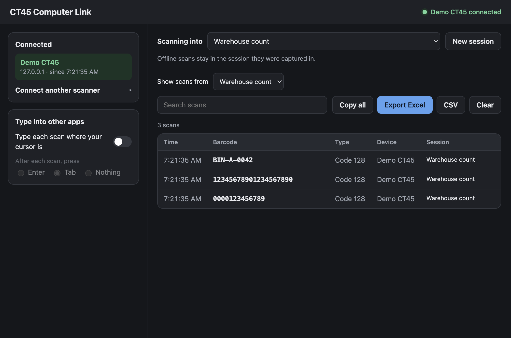
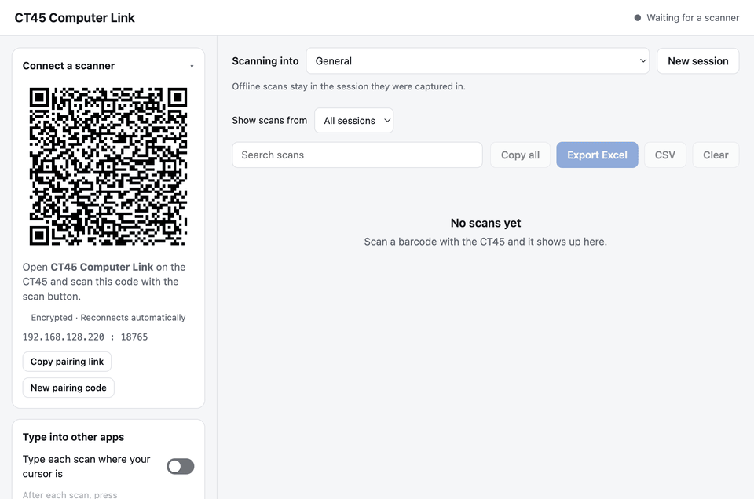
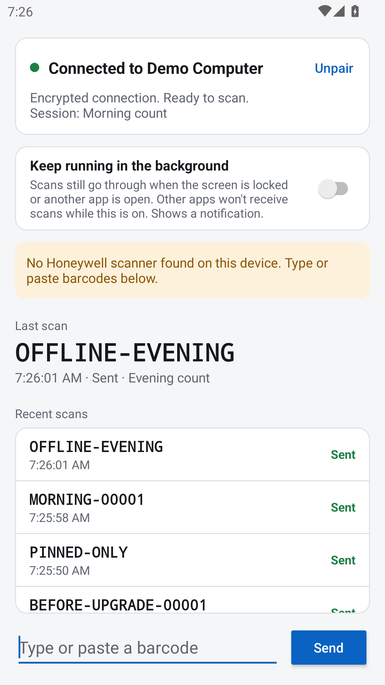

# CT45 Computer Link

Scan a barcode on a Honeywell CT45 and send it to your Mac or Windows computer. Keep a searchable scan log, organize work into named sessions, export to Excel, or type each scan into another app.

**[Download v2.0.0 — desktop installers and Android APK](https://github.com/hnkabraham/CT45-Computer-Link/releases/tag/v2.0.0)**

The development version adds **encrypted Bluetooth for macOS and Android 10+**. It is not included in the v2.0.0 downloads above. Bluetooth hardware validation is in progress; see [Bluetooth setup and testing](docs/bluetooth.md).

It also adds handheld session selection, copying and locally discarding waiting scans, repeated-barcode markers, clearer connection recovery, and visible desktop Copy buttons. These improvements are included in the development branch, not the stable download.

The development Android app opens in a compact scanning view. **Scanning settings** reveals background scanning and optional delivery feedback; **More → Compact scanning view** switches to the full view. The session, latest scan, and waiting count remain visible. **Connection help** explains the selected route, and **Retry now** starts an earlier reconnect without changing pairing or switching routes.

[View the v2.1 desktop and Android UI screenshots](docs/images/v2.1/README.md).



- **Pair once:** scan the computer’s QR code with the CT45.
- **Encrypted connections:** the QR code pins the computer’s TLS certificate. Scans and pairing credentials travel over an encrypted connection.
- **Automatic reconnection:** local network discovery finds the paired computer after its IP address or listening port changes.
- **Offline scans saved and retried:** scans saved on the CT45 wait for the computer to return. Resends are deduplicated.
- **Excel export:** barcodes are text cells, preserving leading zeros, long identifiers, GS1 separators, and values that resemble formulas. CSV is also available.
- **Named sessions:** create or resume a session, then search, copy, export, or clear its scans. Offline scans keep their original session.
- **Optional keyboard input:** type scans into a spreadsheet, browser form, or other app, followed by Enter, Tab, or nothing.

## Install and pair

Download the matching files from [Releases](https://github.com/hnkabraham/CT45-Computer-Link/releases/tag/v2.0.0):

| Device | Download |
|---|---|
| Apple silicon Mac | `CT45-Computer-Link-2.0.0-mac-arm64.dmg` |
| Intel Mac | `CT45-Computer-Link-2.0.0-mac-x64.dmg` |
| Windows x64 | `CT45-Computer-Link-2.0.0-windows-x64.exe` |
| Honeywell CT45 / Android 8+ | `CT45-Computer-Link-2.0.0.apk` |

1. Install and open **CT45 Computer Link** on the computer. On macOS, drag the app from the DMG into Applications. On Windows, run the installer.
2. Open the APK on the CT45 and allow installation from that source when prompted. Alternatively, enable USB debugging and run `adb install -r CT45-Computer-Link-2.0.0.apk`.
3. Connect both devices to the same local network. Open the Android app and use the CT45’s scan button to scan the computer’s QR code.
4. Wait for **Connected**, then scan a barcode. No account or cloud service is needed.

The Mac apps use ad-hoc signatures for integrity; they are **not signed with an Apple Developer ID or notarized**. The Windows installer has no verified publisher signature. macOS and Windows may require an explicit first-run approval. Only approve the app if you trust its source; `SHA256SUMS.txt` in the release lets you check download integrity. On macOS, try **System Settings → Privacy & Security → Open Anyway** after opening the app. If macOS instead reports the downloaded app as damaged, remove its quarantine attribute only after verifying the download:

```sh
xattr -dr com.apple.quarantine "/Applications/CT45 Computer Link.app"
```

On Windows, SmartScreen may show **More info → Run anyway**. Allow incoming connections on your trusted private network when the firewall asks.

### Quick desktop demo



The demo uses a simulated scanner and a disposable pairing code. The Android screenshot below is from an Android 13 emulator; physical Honeywell scanning has not yet been verified for this release.



## Upgrading from v1.0.0

Install both v2 apps, then scan the new pairing QR code once. The encrypted protocol deliberately does not accept the old unencrypted pairing links.

- The published v1.0.0 Android APK can be updated **without uninstalling**. A signing-key rotation preserves its saved scans and settings. This upgrade was tested on Android 13. Builds signed with somebody else’s debug key are a different signing identity and cannot use this upgrade path.
- Android 9+ uses the new dedicated release signing key. Android 8 retains the original signer for compatibility; the APK itself is a non-debuggable release build on every supported version.
- The desktop keeps the previous `CT45 Tracker` data directory so scan history and settings remain available. Earlier scans appear in **General**.
- Keep only one desktop version open. If you previously installed an app named **CT45 Tracker**, replace/remove that app after installing the new one; keep its data directory.

## Sessions, exports, and scanning

**Scanning into** sets the session for newly captured scans. Choose **New session**, enter a name, and start scanning. Select an existing session to resume it. Connected CT45s show the current session; disconnected CT45s keep their last known session until they reconnect. Unpaired scans and history from v1 go into **General**.

**Show scans from** filters the list without changing the active scanning session. Search narrows that view. Click a row to copy its barcode; **Copy all** copies the current view, newest first. **Export Excel** and **CSV** export the session/search results, oldest first, with time, barcode, type, device, and session. Excel is the recommended format when exact barcode text matters: CSV readers may reinterpret numeric strings.

**Clear** removes the selected session’s scans, including those hidden by search. Selecting **All sessions** clears every session’s scans. Export first if you need them. Session names remain available to resume.

In the development builds, **Change session** on the CT45 selects an existing desktop session. This changes the session for new scans from **every connected scanner**. Create sessions on the computer first; waiting scans keep their original session. The control requires a connected desktop with session-control support.

Tap a recent Android scan to **Copy barcode**. A saved scan still marked **Waiting** also offers **Discard locally**, with confirmation. This stops retries on that device and keeps a discard record across restarts. It cannot remove a scan already received by the computer: a lost acknowledgement can leave a received scan marked Waiting. Sent and rejected scans cannot be discarded. New input over 8,192 characters is rejected visibly without truncating it; an oversized entry saved by an older build becomes Rejected so later scans can continue.

On the development desktop, **Seen N×** marks repeated exact barcode text within the same session. Every intentional scan remains in the log and exports; retransmissions with the same scan ID are still deduplicated. Use a row’s **Copy** button with a mouse or keyboard. Connected-device labels distinguish Bluetooth, Network, and Local connection; the address remains in a tooltip. Local connection alone does not identify USB.

Searches with no results show **No matching scans** and **Clear search**, which keeps the selected session. Copy/export are disabled for an empty result; **Clear** still acts on the selected session and asks for confirmation. Android explains when session changes require a connection, a desktop update, or an outstanding request to finish.

**Delivery feedback** is off by default. Choose vibration, sound, or both in Android’s scanning settings or More menu. Computer acknowledgement produces one short vibration and a confirmation tone; a scan saved locally and still waiting after about 1.5–2.5 seconds produces two vibrations and a different tone. Only the chosen feedback types play, and system silent/Do Not Disturb settings take priority. Feedback covers captures from the last minute, groups fast scans, and ignores restored history and duplicate acknowledgements. The Honeywell capture beep is separate. Sound/vibration behavior on the physical CT45 still needs testing.

**Type into other apps** sends new scans to the app containing your cursor. The desktop does not type while its own window is active, or when a scan waited more than 60 seconds before sending. Delayed scans still appear in the log. On macOS, grant Accessibility permission and allow System Events when asked. Windows cannot type into an app running as administrator.

On the CT45, **Keep running in the background** keeps the scanner claimed while another app or the lock screen is visible, with a persistent notification. Turn it off to return the scanner to other apps. Screen-off scanning depends on the device’s Honeywell firmware and scan-button settings. Pairing QR codes are accepted only while this app is on screen.

If the device shows **Not saved**, keep the app open and free storage. It retries saving every five seconds and sends only after saving succeeds. Unsaved in-memory scans cannot survive the app being stopped. Scans made while Android has stopped the scanner app cannot be recovered.

## Connection help

| Symptom | What to check |
|---|---|
| Not connected | Open both v2 apps and scan the current QR code. |
| Cannot reach the computer | Keep the desktop app open. Check the firewall and that both devices can reach each other on the local network. Guest Wi-Fi often blocks this. |
| Computer’s IP changed | Reconnection uses mDNS on the same local network. It starts after the old connection fails; pending scans trigger a check within about 10 seconds. Idle connections can take longer. |
| Discovery is blocked | If your network blocks multicast/mDNS (UDP 5353), rescan the updated QR code or use USB. Discovery does not cross routed subnets automatically. |
| Pairing code changed | Scan the new QR code. Making a new code revokes the previous token. |
| Repeated connection failures after replacing the computer | The app will not send scans. Open the intended computer’s app and scan its QR code again. |
| Scans only work with the Android app open | Enable background mode. If necessary, configure Honeywell Data Intent with action `com.henokabraham.ct45tracker.SCAN` and disable Wedge in the scanner profile. |

**USB fallback:** enable USB debugging, connect the cable, and run `adb reverse tcp:8765 tcp:8765`. If the desktop shows a different port, substitute it on both sides. The QR code includes the loopback route; encrypted connections work over USB too. Repeat the command after reconnecting the cable.

**Bluetooth fallback (development version):** on a Mac, select **Enable Bluetooth**, scan the updated QR code, then choose **Change connection → Bluetooth** on the CT45. Allow Nearby devices when asked. If the pairing code has no Bluetooth endpoint, **Use Wi-Fi / USB** offers a guided switch. This works without a shared network and uses the same pinned TLS encryption. Windows Bluetooth is not implemented; Wi-Fi and USB remain available on Windows. See the [setup guide](docs/bluetooth.md) for requirements and troubleshooting. Android’s **More** menu contains **Unpair**.

## Privacy and security

Barcode traffic uses TLS 1.2 or later. The Android app checks the exact certificate fingerprint from the QR code before sending its pairing token. Network discovery advertises only a public computer ID and port; a matching discovery name alone is not trusted. A new IP address does not require trusting a new certificate.

The pairing QR code grants access to send scans and should be kept private. Use **New pairing code** to revoke it. Scans and exports are stored locally, without additional at-rest encryption; protect them with your device’s account and disk security. There is no scan telemetry or cloud upload. The desktop identity lasts ten years; a replacement identity requires pairing again.

When enabled, Bluetooth advertises the persistent public computer UUID nearby, without credentials or barcode contents. The Android scanner receiver accepts Honeywell-style scan broadcasts from other local apps; it cannot prove that a barcode came from the optical trigger. Only install trusted apps on scanning devices, especially when desktop keyboard input is enabled.

## Development

The desktop uses Electron and Node.js 20+; Android uses Kotlin, JDK 17, and the Android SDK. Application IDs and the `ct45tracker://pair` scheme are retained for compatibility.

```sh
git clone https://github.com/hnkabraham/CT45-Computer-Link.git
cd CT45-Computer-Link/desktop
npm ci
npm run build:bluetooth # macOS: build the native helper before testing Bluetooth
npm start
npm test
npm run e2e
npm run fake-scanner -- "<pairing link>" 0000123456789
npm run dist:mac
npm run dist:win

cd ../android
./gradlew testDebugUnitTest assembleDebug assembleRelease lintDebug
```

`assembleRelease` produces an unsigned APK. The maintainer signs it with `android/scripts/sign-release.sh`; private keys and passwords live outside this repository. See [release signing and recovery](docs/releasing.md) and the [protocol specification](docs/protocol.md).

Android integration tests require a **disposable emulator** because they clear app data and change its temporary lock settings:

```sh
cd desktop
ANDROID_SERIAL=emulator-5580 npm run android-e2e
ANDROID_SERIAL=emulator-5580 node scripts/android-polish-e2e.mjs
OLD_APK=/path/to/CT45-Computer-Link-1.0.0-debug.apk \
  ANDROID_SERIAL=emulator-5580 node scripts/android-release-e2e.mjs
```

The release test installs v1, upgrades to the signed v2 APK, and checks preserved scans, certificate rejection, offline sessions, and discovery at a new endpoint. The emulator must start without this app installed. mDNS testing needs a network that carries discovery traffic.

The polish test reinstalls the debug app on the selected disposable emulator, then checks oversized queue recovery, session selection, local discard persistence, connection help, compact layouts, and feedback preferences. Set `SCREENSHOT_DIR` to save synthetic UI examples. It does not test Bluetooth radio delivery, Honeywell optics, or physical sound/vibration behavior.

**Validation limits:** automated tests and emulator checks do not replace testing a physical CT45, Windows, or a particular corporate Wi-Fi network. macOS installers are built for both architectures; Windows is cross-built. See the release notes for the exact checks performed.
