# Clear interface

Screenshots of the implemented 2.1.0 development interface. Android captures are from September 30, 2026; desktop captures were refreshed October 1 with the [new logo](../../branding/README.md). The Android app now uses the same logo in its header and launcher. The stable download remains 2.0.0. The [original Clear concept](../../design/redesign-concepts/01-clear.png) informed the layout; these images show the running apps.

All example barcodes, scanner names, and sessions are synthetic. Desktop screenshots use a disposable test profile and simulated scanner over encrypted loopback. The pictured pairing QR code is no longer active. Android screenshots come from a disposable Android 13 emulator, whose missing-Honeywell-scanner notice is expected.

## Desktop

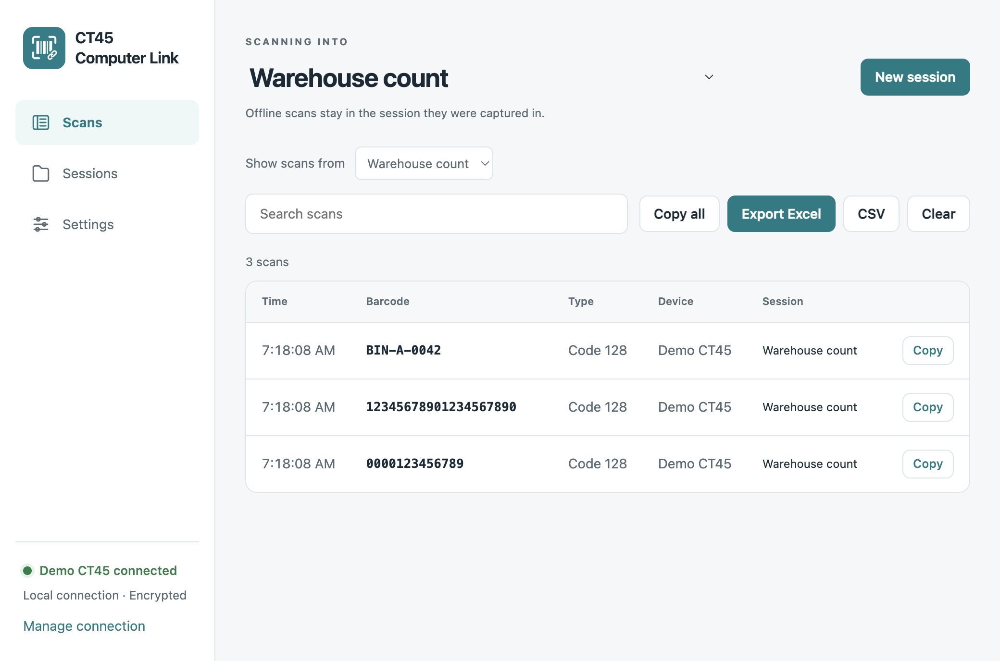

| Sessions | Connection and typing settings |
|---|---|
| 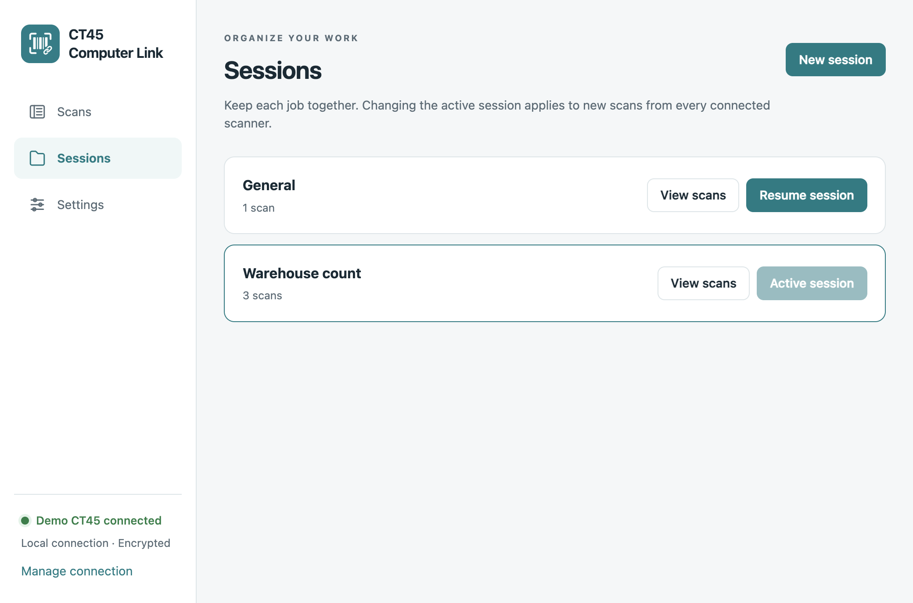 | 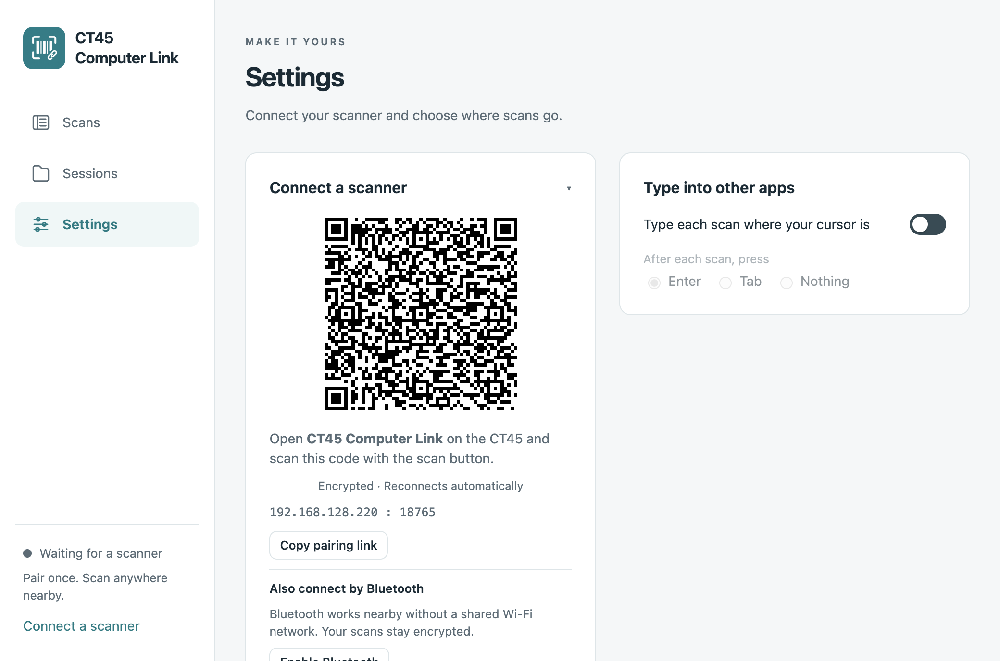 |

| Dark appearance | Narrow window |
|---|---|
| 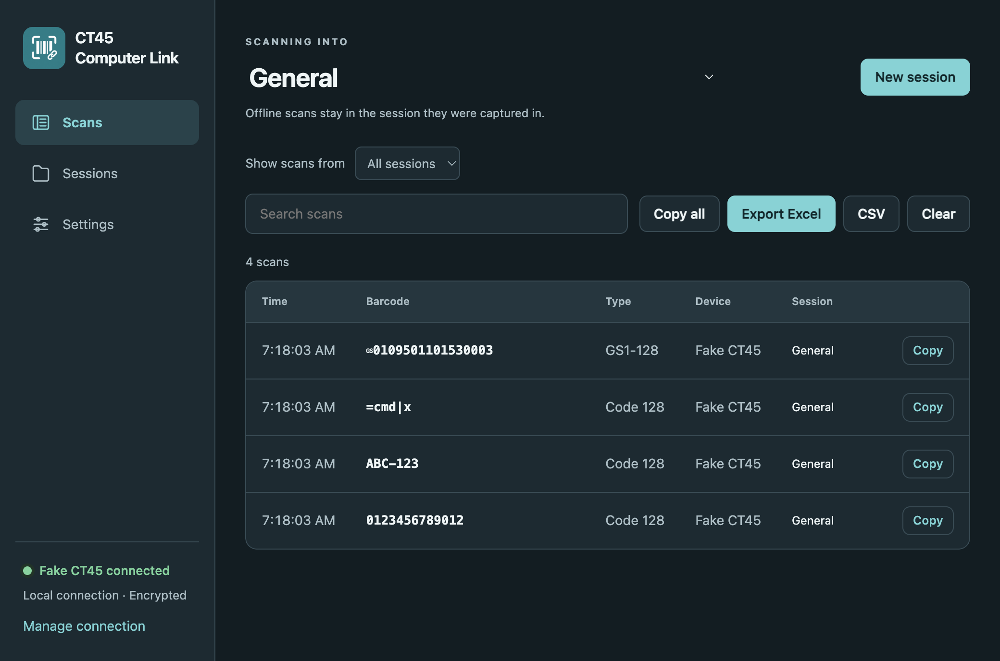 | 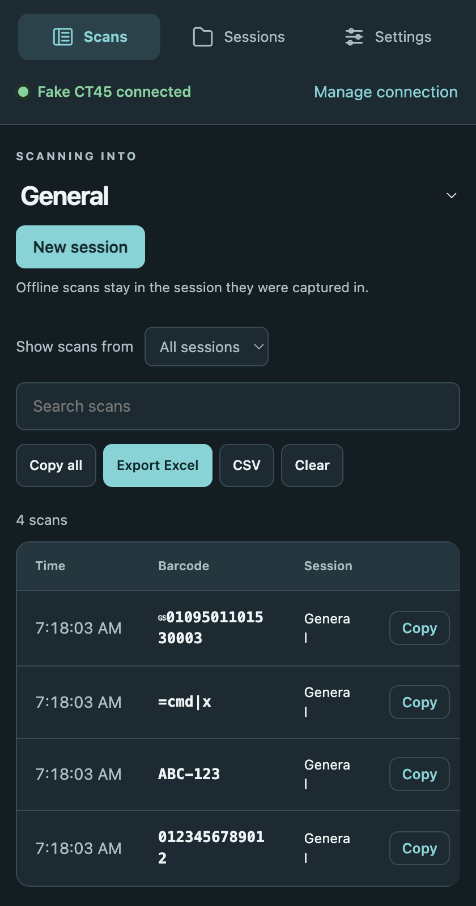 |

## Android

| Scan | History | Settings |
|---|---|---|
| 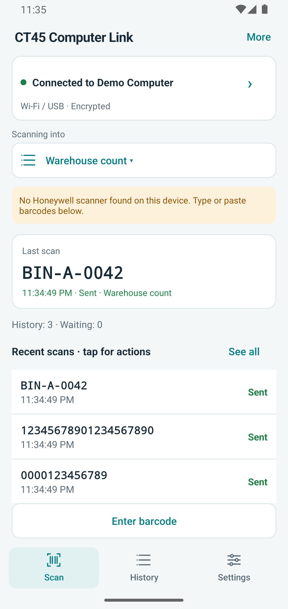 | 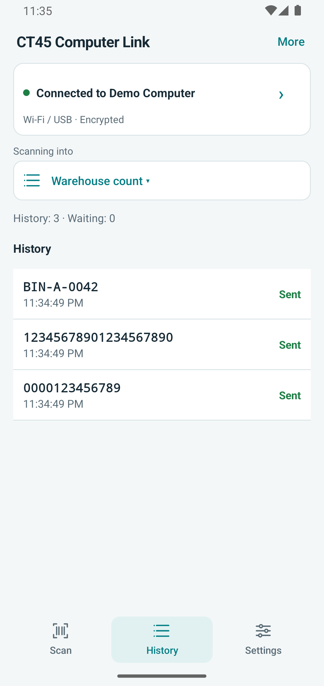 | 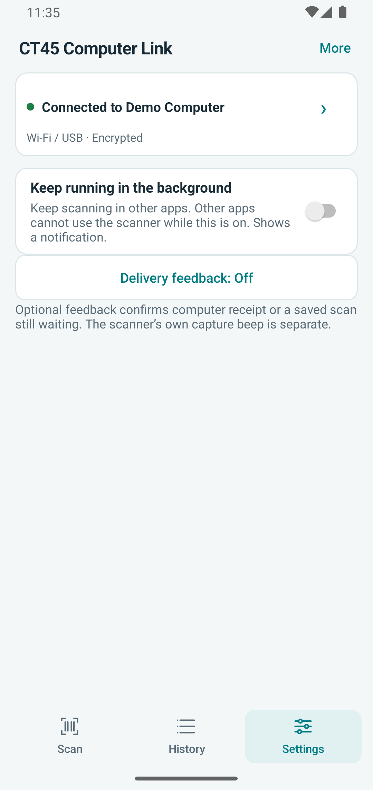 |

| Dark appearance | Waiting scan | Small screen |
|---|---|---|
| 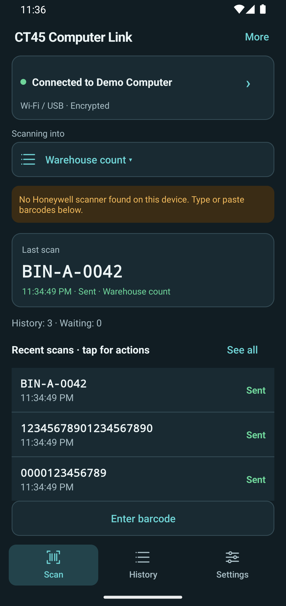 | 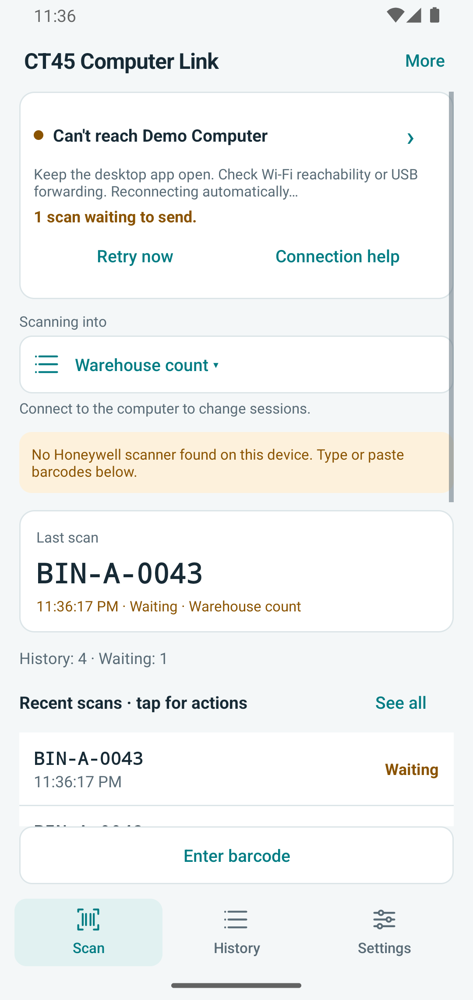 | 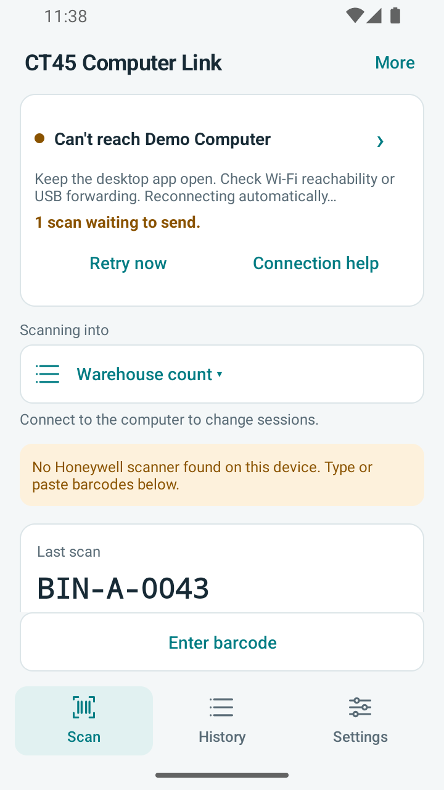 |

These screenshots document appearance. See [validation notes](../../validation-2.1.md) for the scope of software and physical-device testing.
