# v2.1 UI screenshots

Captured September 30, 2026 from the 2.1.0 development builds. These screens show the upcoming interface; the published stable download remains v2.0.0. See [Bluetooth setup and validation](../../bluetooth.md) for current hardware test results.

All barcodes and scanner names shown here are synthetic examples. The desktop screenshots use a disposable test profile; the pictured pairing code no longer works.

## Desktop

Captured from the Electron desktop app running the current source on macOS. The scan list uses a simulated scanner. The pairing screen offers Bluetooth setup; no Bluetooth scanner is connected in these captures.

### Pairing and Bluetooth setup

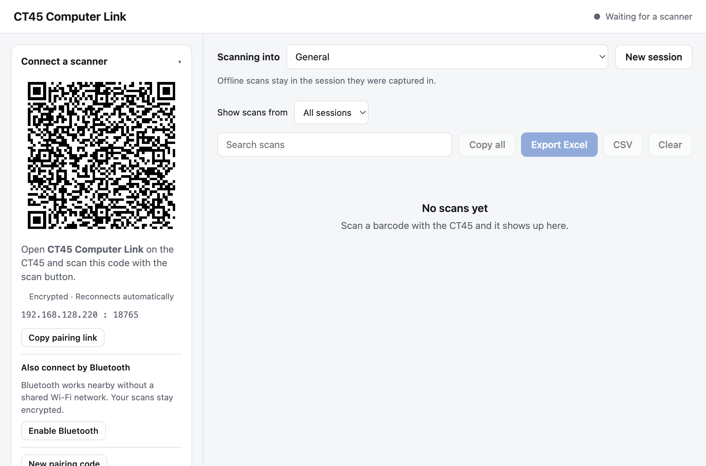

### Named scanning session and export controls

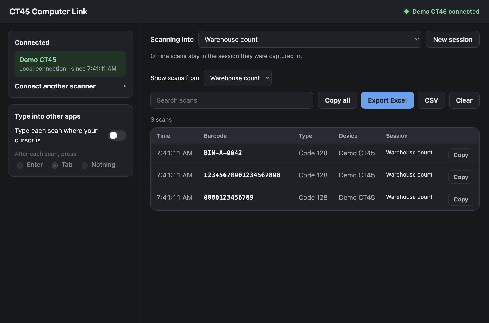

### Light and dark appearance

| Light | Dark |
|---|---|
| 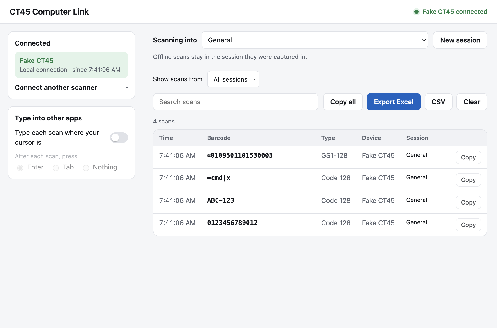 | 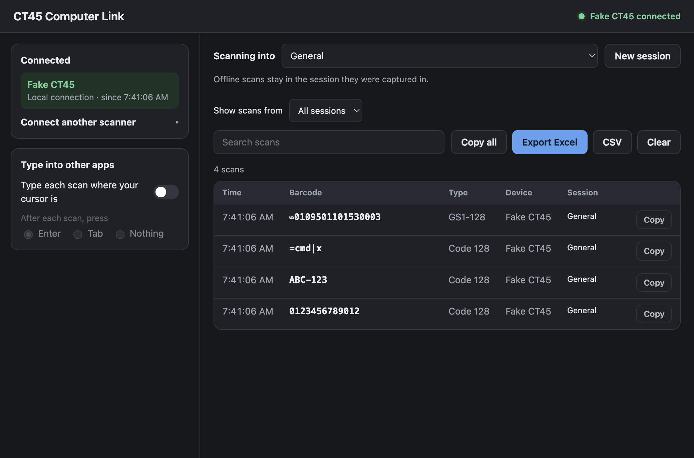 |

### Narrow window

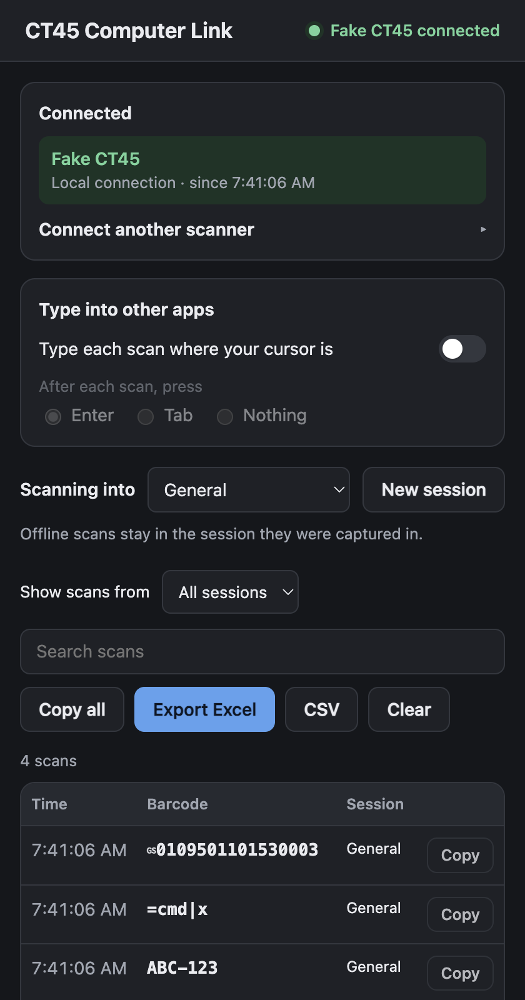

### Repeated barcodes and Copy actions

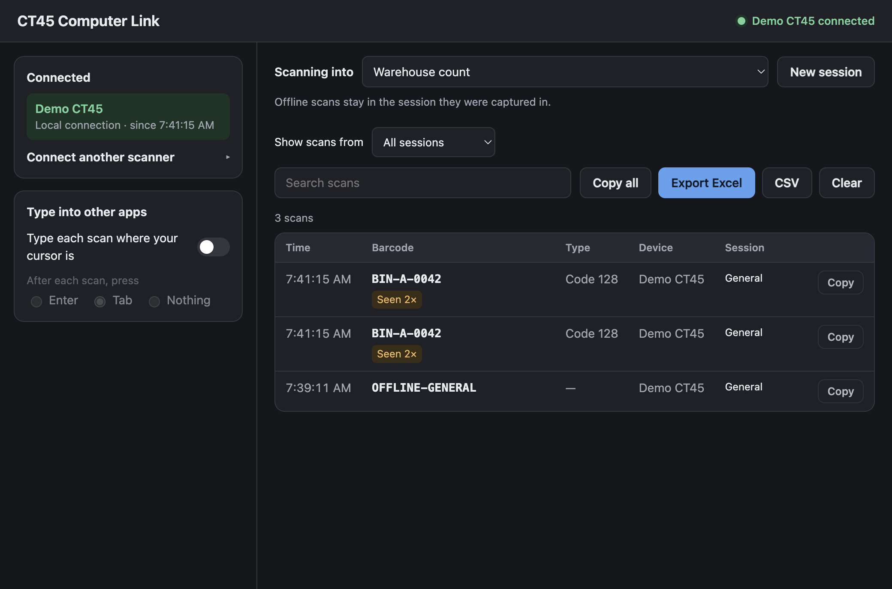

### Search with no matches

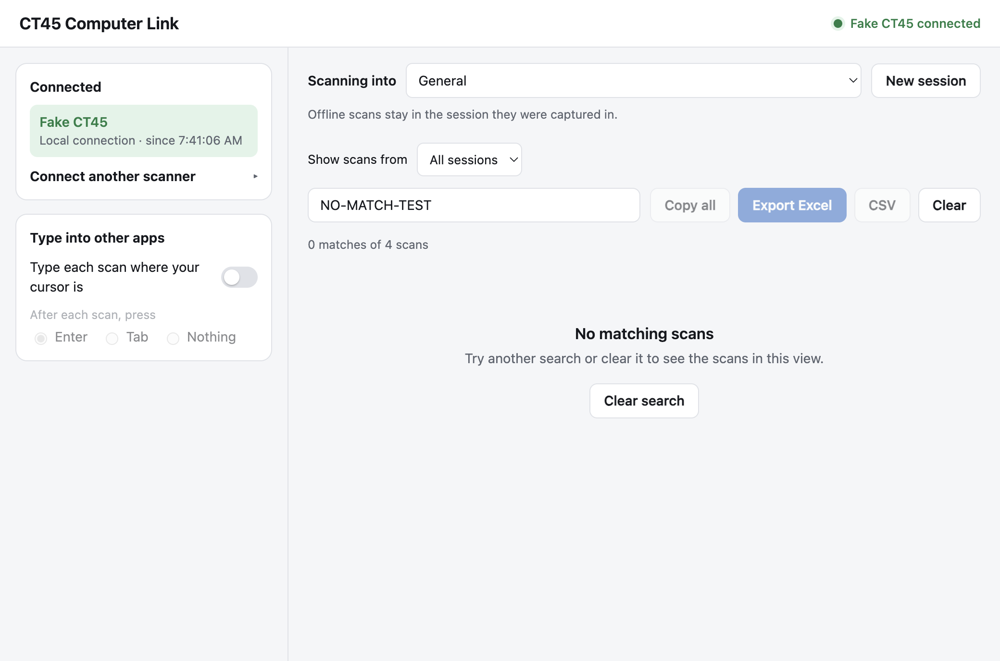

## Android

Captured from the current 2.1.0 debug build on an Android 13 emulator, not the physical CT45. The emulator has no Honeywell scanner, so its scanner warning is visible. The connected views use a real pinned TLS connection to a temporary local server; barcode input is simulated. The connection menu illustrates the Bluetooth option, not a Bluetooth connection from the emulator.

| Connected, light appearance | Connected, dark appearance |
|---|---|
| 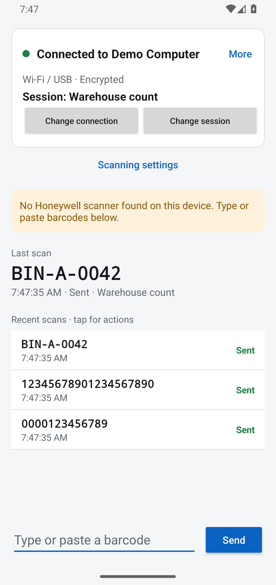 | 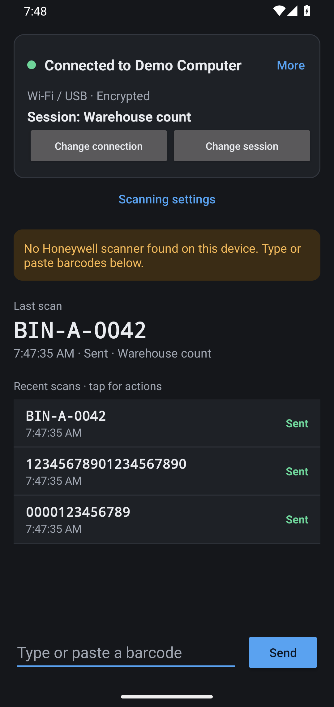 |

| Connection choices | Saved scan waiting to send |
|---|---|
| 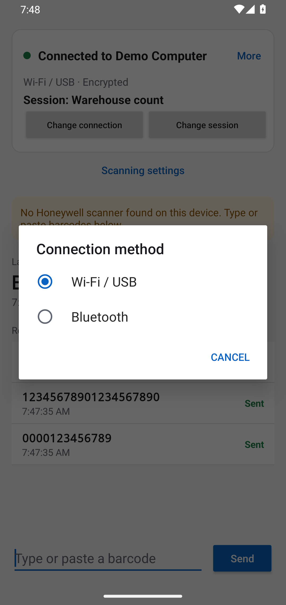 | 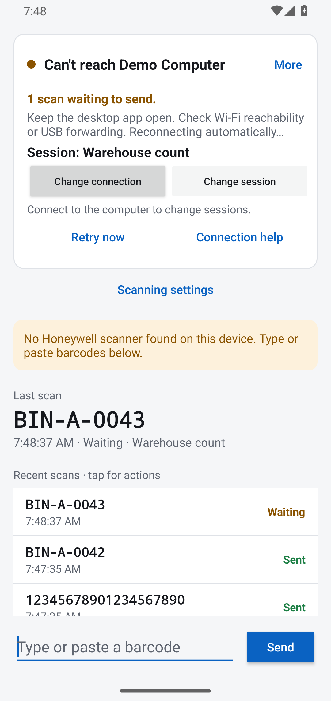 |

| Expanded scanning settings | Optional delivery feedback |
|---|---|
| 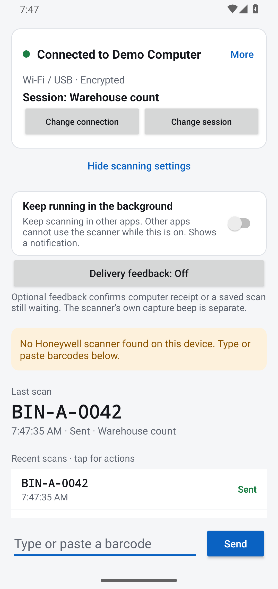 | 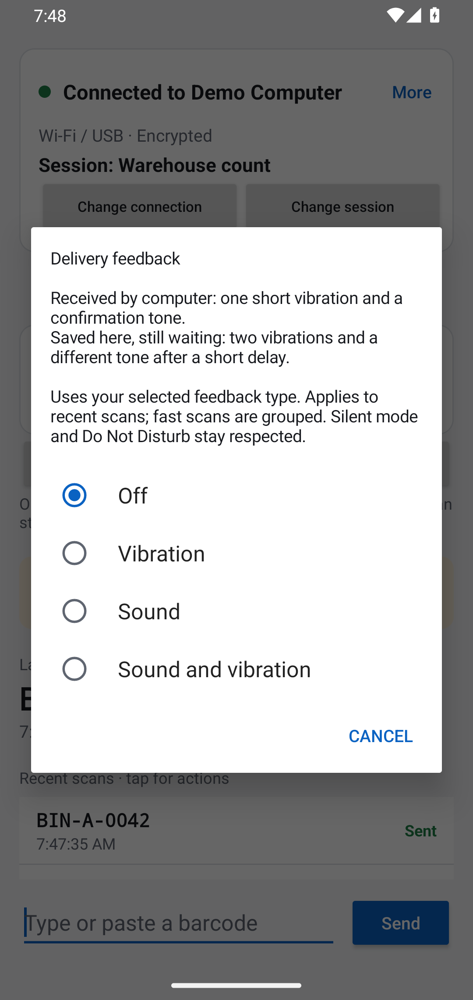 |

| Shared session selection | Waiting scan actions |
|---|---|
| 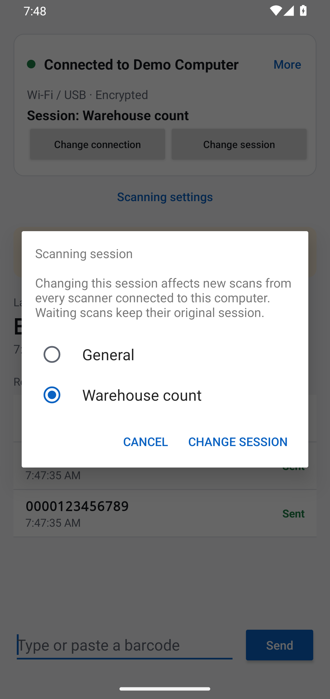 | 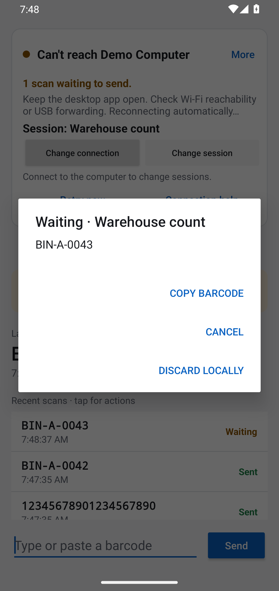 |

| Guided connection recovery | Compact screen after scrolling |
|---|---|
| 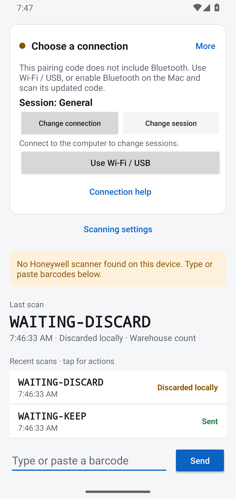 | 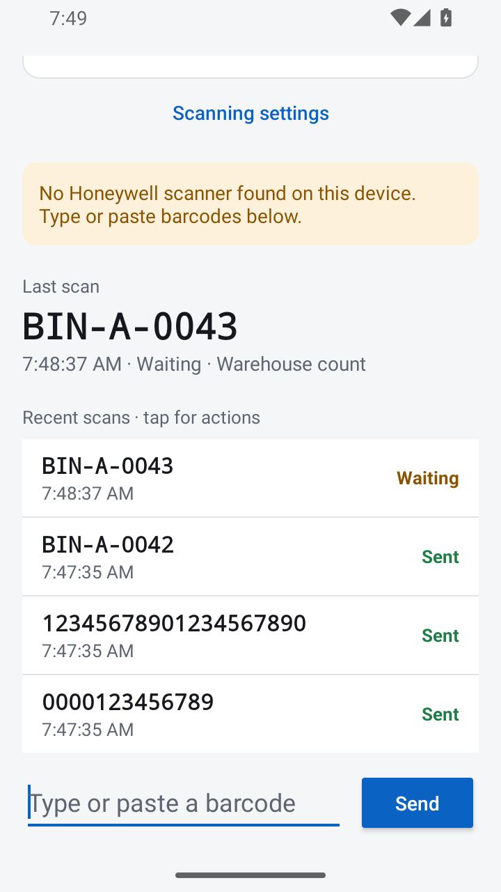 |

The original PNG files in this folder are available at full resolution. These screenshots document the interface; they do not verify optical scanning or screen-off scanning on Honeywell hardware.
